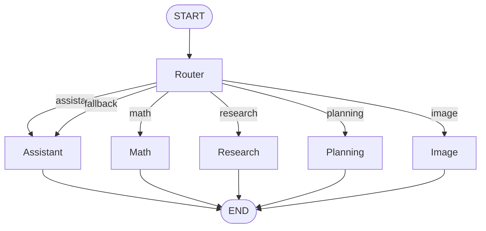
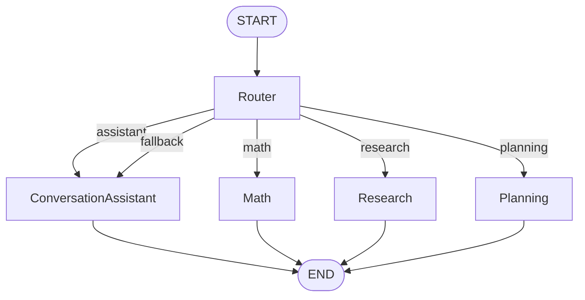
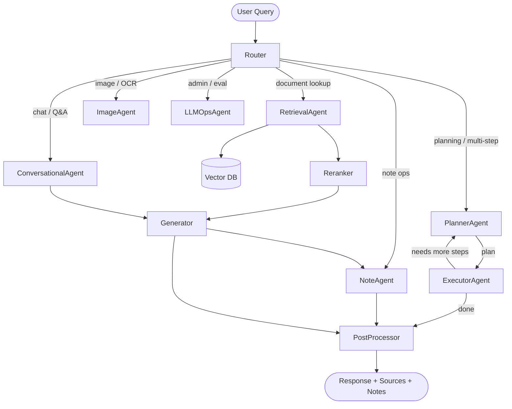

token cost per response:

- Ip = input price per token
- Op = output price per token
- query or q = user query
- t_i = total tokens after asking question i-th
- cached: message history

cached = 0

- t=1:
  input_1: query + cached
  output_1
  cost_1 = ip*(input_1 ) + op*(output_1)
  cached = input_1 + output_1

- t=2:
  input_2: query + cached
  output_2
  cost_2 = ip(input_2) + op\*(output_2)
  cached = input_1 + output_1 + input_2 + output_2

- t=3:
  input_3: query + cached
  output_3
  cost_3 = ip(input_3)+op(output_3)
  cached = input_1 + output_1 + input_2 + output_2 + input_3 + output_3

...

```
total_cost = cost_1 + cost_2 + cost_3 + ... + cost_n
total_cost = Ip(I1) + Op(O1) + Ip(I2) + Op(O2) + Ip(I3) + Op(O3) + ... + Ip(In) + Op(On)
           = Ip(I1 + I2 + ... + In) + Op(O1 + O2 + ... + On)
           = Ip[(q + 0) + (q + I1 + O1) + (q + I1 + O1 + I2 + O2) + ... + (q + (I1 + ... + I{n-1}) + (O1 + ... + O{n-1}))] +
             Op(O1 + O2 + ... + On)
           = Ip[n*q + (n-1)*(I1 + O1) + (n-2)*(I2 + O2) + ... (1)*(Ii + Oi)] + Op(O1 + ... + On)
           ~= Ip[n*q + (O+I)*(n*(n-1)/2)] + Op(n*O)

cost for next question = Ip(query + cached) + Op(On)
                       = Ip(query + (I1 + I2 + ... + I{n-1}) + (O1 + O2 + ... + O{n-1})) + Op*On
                       = Ip(q + (n-1)*(I+O)) + Op*On

```
