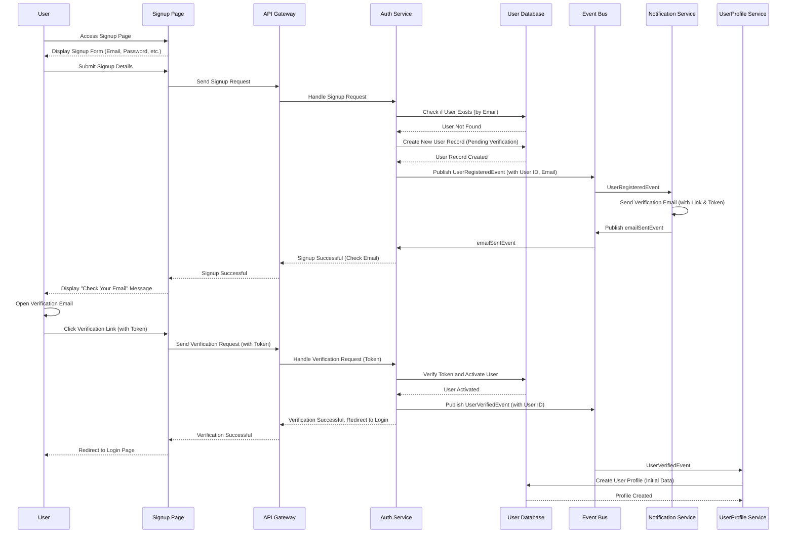
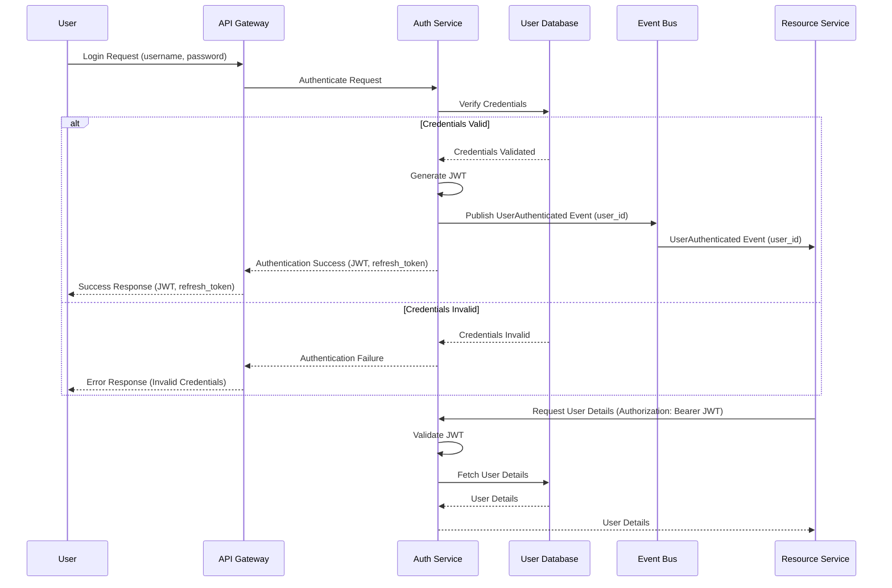

# Sign Up FLow

```mermaid
sequenceDiagram
    participant User
    participant Signup Page
    participant API Gateway
    participant Auth Service
    participant User Database
    participant Event Bus
    participant Notification Service
    participant UserProfile Service

    User->>Signup Page: Access Signup Page
    Signup Page-->>User: Display Signup Form (Email, Password, etc.)

    User->>Signup Page: Submit Signup Details
    Signup Page->>API Gateway: Send Signup Request
    API Gateway->>Auth Service: Handle Signup Request
    Auth Service->>User Database: Check if User Exists (by Email)
    User Database-->>Auth Service: User Not Found
    Auth Service->>User Database: Create New User Record (Pending Verification)
    User Database-->>Auth Service: User Record Created
    Auth Service->>Event Bus: Publish UserRegisteredEvent (with User ID, Email)

    Event Bus->>Notification Service: UserRegisteredEvent
    Notification Service->>Notification Service: Send Verification Email (with Link & Token)
    Notification Service->>Event Bus: Publish emailSentEvent
    Event Bus->>Auth Service: emailSentEvent

    Auth Service-->>API Gateway: Signup Successful (Check Email)
    API Gateway-->>Signup Page: Signup Successful
    Signup Page-->>User: Display "Check Your Email" Message

    User->>User: Open Verification Email
    User->>Signup Page: Click Verification Link (with Token)
    Signup Page->>API Gateway: Send Verification Request (with Token)
    API Gateway->>Auth Service: Handle Verification Request (Token)
    Auth Service->>User Database: Verify Token and Activate User
    User Database-->>Auth Service: User Activated
    Auth Service->>Event Bus: Publish UserVerifiedEvent (with User ID)
    Auth Service-->>API Gateway: Verification Successful, Redirect to Login
    API Gateway-->>Signup Page: Verification Successful
    Signup Page-->>User: Redirect to Login Page

    Event Bus->>UserProfile Service: UserVerifiedEvent
    UserProfile Service->>User Database: Create User Profile (Initial Data)
    User Database-->>UserProfile Service: Profile Created

```

# Login Flow

```mermaid
sequenceDiagram
    participant User
    participant API Gateway
    participant Auth Service
    participant User Database
    participant Event Bus
    participant Resource Service

    User->>API Gateway: Login Request (username, password)
    API Gateway->>Auth Service: Authenticate Request
    Auth Service->>User Database: Verify Credentials
    alt Credentials Valid
        User Database-->>Auth Service: Credentials Validated
        Auth Service->>Auth Service: Generate JWT
        Auth Service->>Event Bus: Publish UserAuthenticated Event (user_id)
        Event Bus->>Resource Service: UserAuthenticated Event (user_id)
        Auth Service-->>API Gateway: Authentication Success (JWT, refresh_token)
        API Gateway-->>User: Success Response (JWT, refresh_token)
    else Credentials Invalid
        User Database-->>Auth Service: Credentials Invalid
        Auth Service-->>API Gateway: Authentication Failure
        API Gateway-->>User: Error Response (Invalid Credentials)
    end
    Resource Service->>Auth Service: Request User Details (Authorization: Bearer JWT)
    Auth Service->>Auth Service: Validate JWT
    Auth Service->>User Database: Fetch User Details
    User Database-->>Auth Service: User Details
    Auth Service-->>Resource Service: User Details
```
