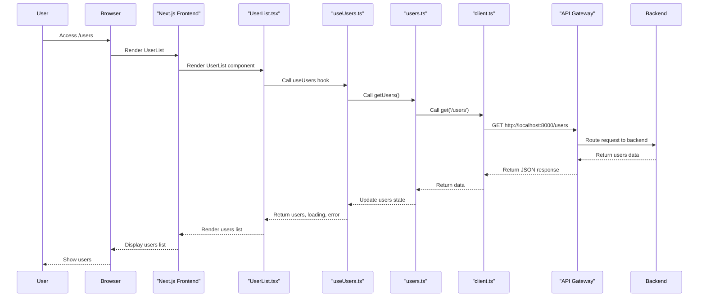

```mermaid
sequenceDiagram
participant User
participant Browser
participant NextJS as "Next.js Frontend"
participant UserList as "UserList.tsx"
participant useUsers as "useUsers.ts"
participant usersTs as "users.ts"
participant clientTs as "client.ts"
participant APIGateway as "API Gateway"
participant Backend

    User->>Browser: Access /users
    Browser->>NextJS: Render UserList
    NextJS->>UserList: Render UserList component
    UserList->>useUsers: Call useUsers hook
    useUsers->>usersTs: Call getUsers()
    usersTs->>clientTs: Call get('/users')
    clientTs->>APIGateway: GET http://localhost:8000/users
    APIGateway->>Backend: Route request to backend
    Backend-->>APIGateway: Return users data
    APIGateway-->>clientTs: Return JSON response
    clientTs-->>usersTs: Return data
    usersTs-->>useUsers: Update users state
    useUsers-->>UserList: Return users, loading, error
    UserList-->>NextJS: Render users list
    NextJS-->>Browser: Display users list
    Browser-->>User: Show users
```
